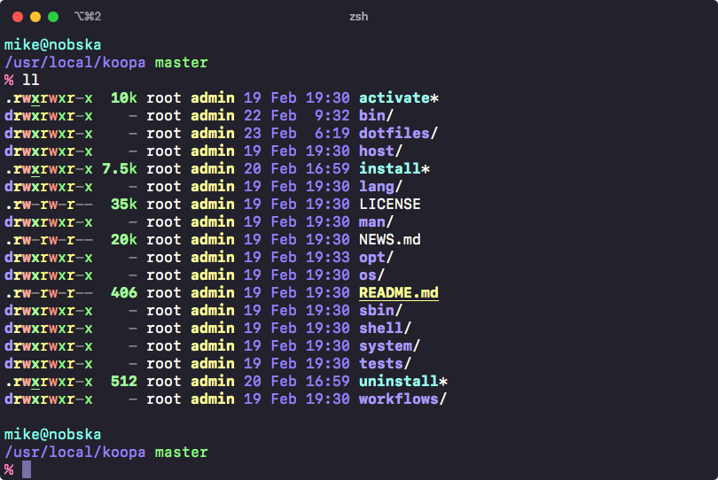

Source code is available on [GitHub](https://github.com/acidgenomics/koopa).

# Requirements

- [POSIX][]-compliant shell: [Bash][] or [Zsh][]
- Linux or macOS

Dependencies for executable scripts:

- [Bash][] >= 4
- [Python][] >= 3.8
- [R][] >= 3.6

# Installation

Requirements: bash, curl, git.

```sh
bash -c "$(curl -sSL https://koopa.acidgenomics.com/install)"
```

The installer will prompt to determine whether you want a shared install for all users, or for the current local user only.

## Update shell configuration (local user only)

Note that this step is not required for a shared installation on Linux, which writes a configuration file into `/etc/profile.d` instead.

To activate koopa on login, add these lines to your shell configuration file:

```sh
# koopa shell
# https://koopa.acidgenomics.com/
# shellcheck source=/dev/null
XDG_CONFIG_HOME="${XDG_CONFIG_HOME:-${HOME}/.config}"
if [ -f "${XDG_CONFIG_HOME}/koopa/activate" ]
then
    . "${XDG_CONFIG_HOME}/koopa/activate"
fi
```

Not sure where to source `activate` in your configuration? Here are some general recommendations, in order of priority for each shell. These can differ depending on the operating system, so refer to your shell documentation for details.

- [bash][]: `.bashrc`, `.bash_profile`
- [zsh][]: `.zshrc`

## Check installation

Restart the shell. Koopa should now activate automatically at login. You can verify this with `command -v koopa`. Next, check your environment dependencies with `koopa check`. To obtain information about the working environment, run `koopa info`.

# Docker images

## Recommended

These images contain koopa along with other useful bioinformatics software.

- [Debian](https://hub.docker.com/repository/docker/acidgenomics/debian)
- [Ubuntu](https://hub.docker.com/repository/docker/acidgenomics/ubuntu)
- [Fedora](https://hub.docker.com/repository/docker/acidgenomics/fedora)
- [CentOS](https://hub.docker.com/repository/docker/acidgenomics/centos)

Pre-installed software:

- [R][]
- [Python][]
- [Perl][]
- [Conda]
- [AWS CLI][]
- [Azure CLI][]
- [Google Cloud SDK][]

## Lightweight

These images only contain koopa installed on top of the base Docker image.

- [Alpine](https://hub.docker.com/repository/docker/acidgenomics/alpine)
- [Arch](https://hub.docker.com/repository/docker/acidgenomics/arch)
- [Amazon Linux](https://hub.docker.com/repository/docker/acidgenomics/amzn)
- [Kali](https://hub.docker.com/repository/docker/acidgenomics/kali)
- [openSUSE](https://hub.docker.com/repository/docker/acidgenomics/opensuse)

[aspera connect]: https://downloads.asperasoft.com/connect2/
[aws cli]: https://aws.amazon.com/cli/
[azure cli]: https://docs.microsoft.com/en-us/cli/azure/install-azure-cli
[bash]: https://www.gnu.org/software/bash/  "Bourne Again SHell"
[bcbio]: https://bcbio-nextgen.readthedocs.io/
[conda]: https://conda.io/
[dash]: https://wiki.archlinux.org/index.php/Dash  "Debian Almquist SHell"
[dotfiles]: https://github.com/mjsteinbaugh/dotfiles/
[fish]: https://fishshell.com/  "Friendly Interactive SHell"
[git]: https://git-scm.com/
[google cloud sdk]: https://cloud.google.com/sdk/
[koopa]: https://koopa.acidgenomics.com/
[ksh]: http://www.kornshell.com/  "KornSHell"
[perl]: https://www.perl.org/
[pgp]: https://www.openpgp.org/
[posix]: https://en.wikipedia.org/wiki/POSIX  "Portable Operating System Interface"
[python]: https://www.python.org/
[python]: https://www.python.org/
[r]: https://www.r-project.org/
[ssh]: https://en.wikipedia.org/wiki/Secure_Shell
[tcsh]: https://en.wikipedia.org/wiki/Tcsh  "TENEX C Shell"
[zsh]: https://www.zsh.org/  "Z SHell"
